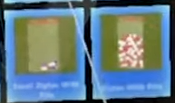
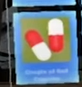
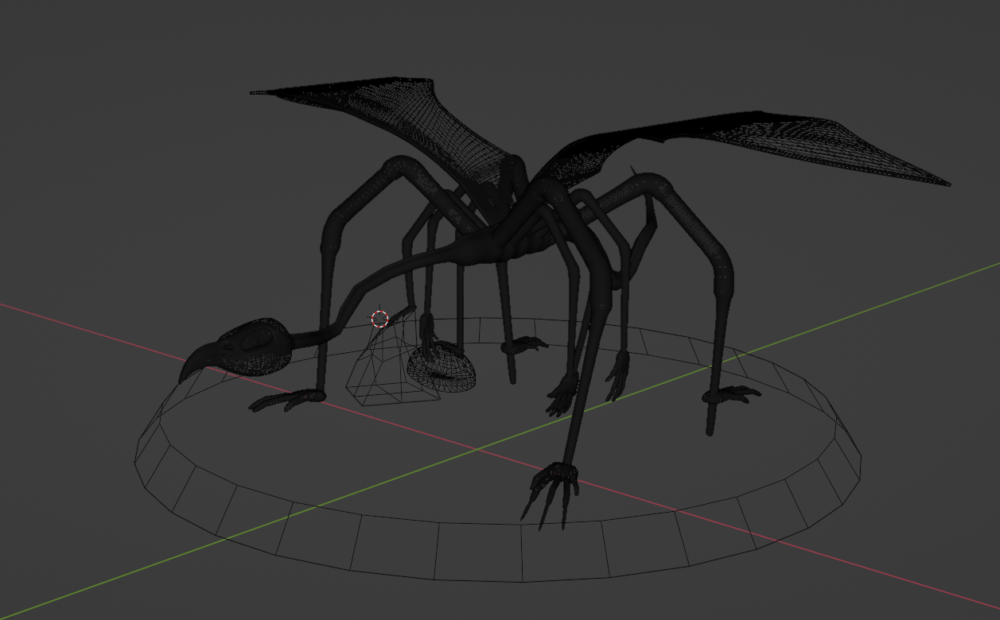
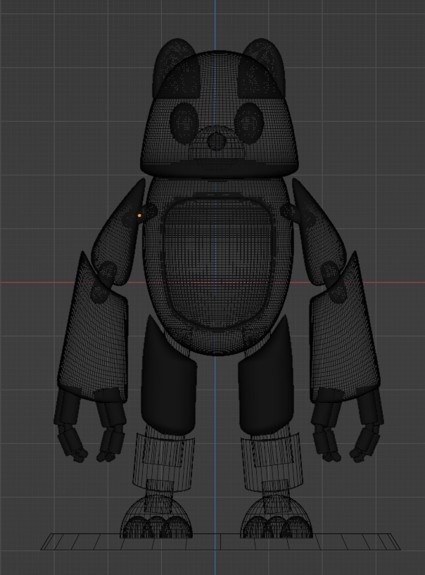
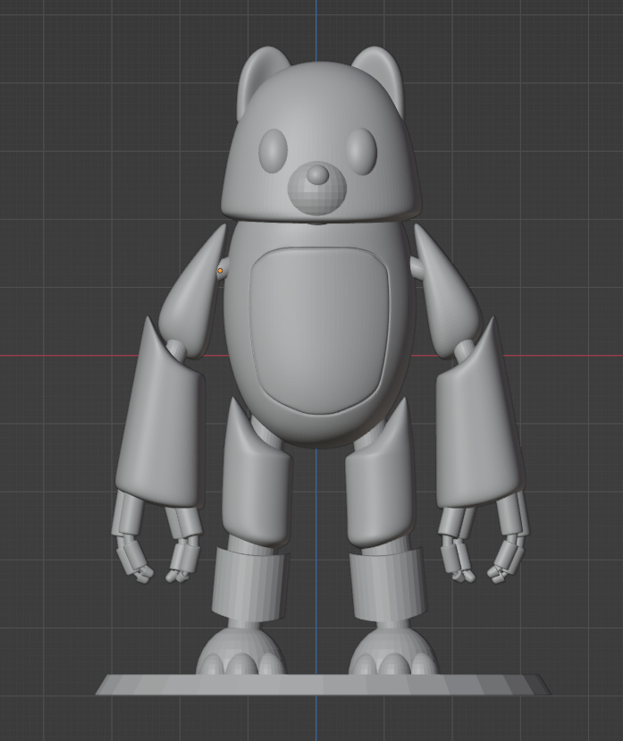
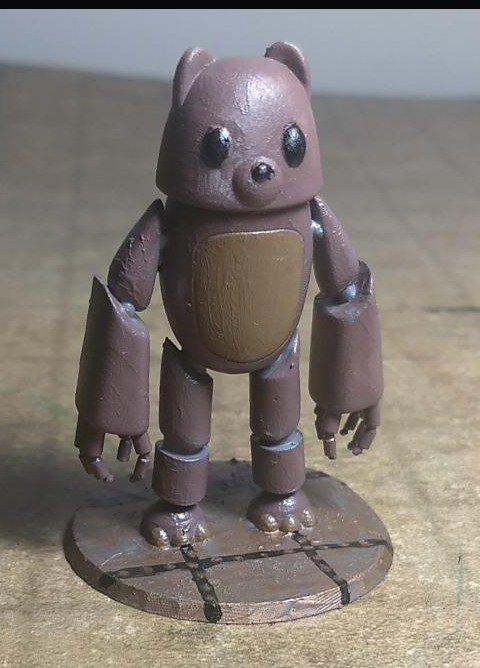
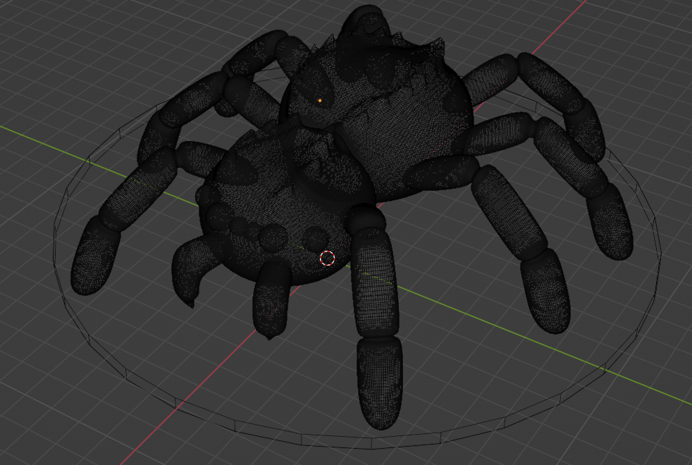

# Gallery
Assorted 3D modelling works I have done in Maya and Blender.

## Forensic XR: Channel 7 News Segment on Forensic XR
As part of my TAFE Cert III in Information Technology, I did a work placement with Mobile Apps Man. They were contracted to create models for the  application- a mobile app for training in forensic crime by simulating crime scenes. During a segment on [Channel 7 News](https://www.youtube.com/watch?v=5_RpIg_rC30&ab_channel=7NEWSAustralia) on Forensic XR, they showed models I created (a bag of pills along with individual pills), which I had modelled based on research I had done on real-world pill sizes, pill colour coding, and zip lock bag sizes to provide the most accurate models possible. 

## Fateweaver
I designed the Fateweaver (and the Spider) below as part of a DnD campaign I created. A significant challenge with the Fateweaver was making it printable (the legs are thinner than the support structures used to print them), but still faithful to the concept of a fragile, yet intimidating creature. Maintaining the proportions and scale is easy virtually but more challenging when it comes to 3D printing. I wanted to keep its proportions, as the slender, bone-like figure portrayed the creature’s fragility very well. This made it very difficult to print. I ended up taking a long time (~2 hours) taking it off the printer and processing it so as to not break anything.

## Robotic Teddy Bear
The Robot Teddy Bear is a 12’ robot in the game, which, based on the normal 5’=25mm scale, is a 60mm miniature. The Robotic Teddy Bear was a friend's creation and, based on his concept art I modelled, printed and painted the bear. 

## Spider
The spider design is another large creature which, in game terms, creates portal in a manner similar to the Portal gun in the game Portal. Modelling was based on a real world jumping spider, but the ridging along the back is a divergence meant to differentiate it from other spiders and place it as a unique part of the world. The legs were thickened to make it easier to print, which is why they are slightly larger than they would be on an actual spider.

